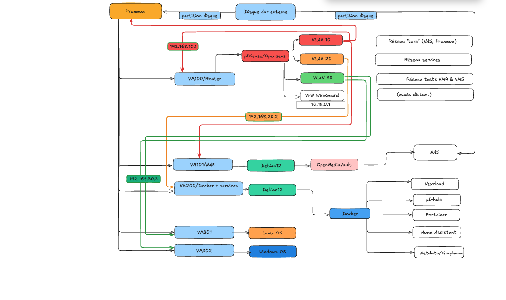
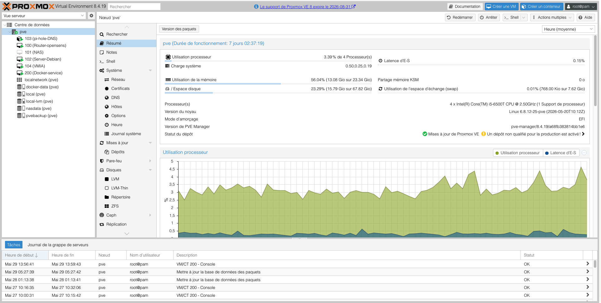
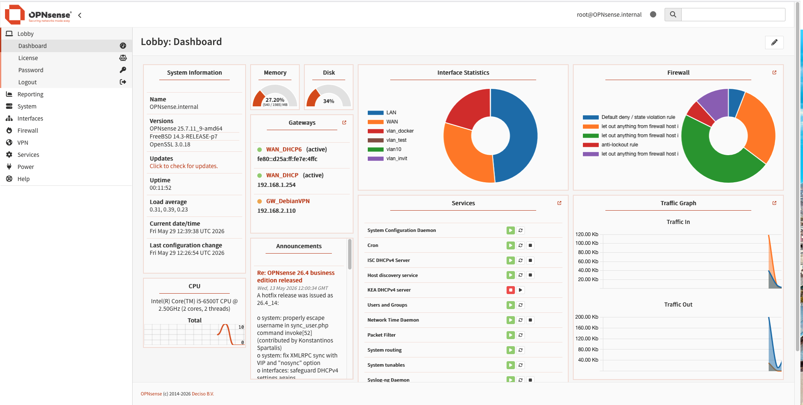
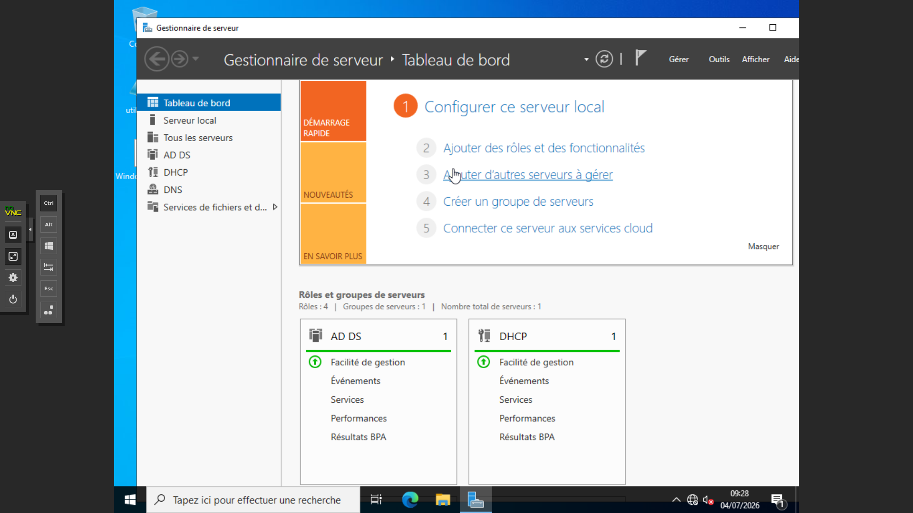
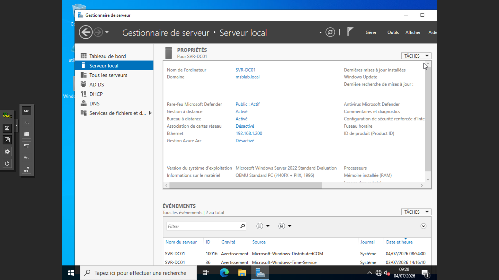
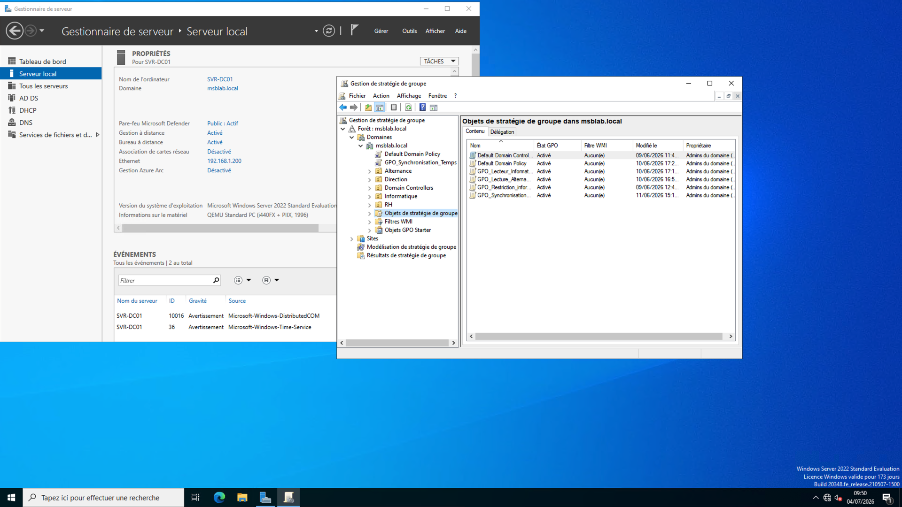
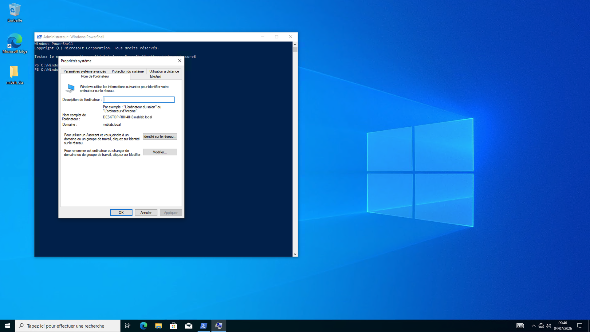
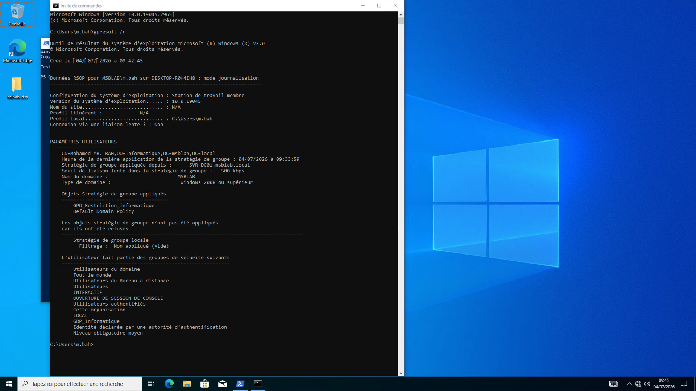
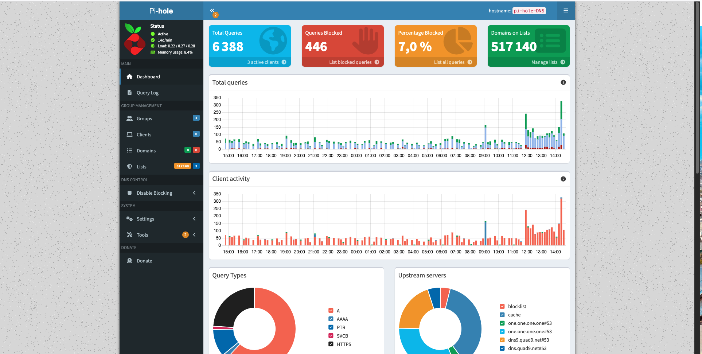
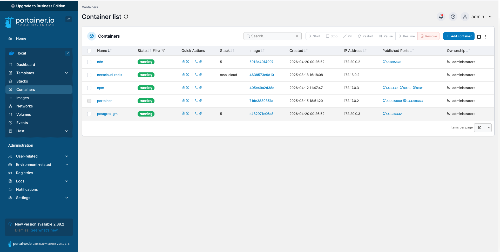

# homelab-infra

Infrastructure personnelle en production, réseau segmenté, virtualisation, services auto-hébergés.
Tout tourne sur réseau physique local à Toulouse.

---

## Matériel

| Composant | Détail |
|---|---|
| Hyperviseur | Proxmox VE 8.4.19 |
| CPU | Intel Core i5-6500T @ 2.50GHz (4 cœurs) |
| RAM | 23.34 Go |
| Stockage système | 67.82 Go |
| Stockage NAS | Disque dur externe partitionné, monté sur Proxmox |
| Switch | Cisco SG200-08 |

**Réseau physique**

```
Prise Ethernet (FAI)
        │
        ▼
[Switch Cisco SG200-08]
        │
   ┌────┴────┐
   ▼         ▼
[PC]    [Serveur Proxmox]
```

---

## Architecture

> *Schéma architecture*



---

## Machines virtuelles

| VM | Nom | OS | Rôle |
|---|---|---|---|
| VM 100 | Router-opensens | OPNsense 25.7.3 | Routeur / Pare-feu |
| VM 101 | NAS | Debian 12 | NAS avec OpenMediaVault, Nextcloud et Samba |
| VM 102 | Server-Debian | Debian 12 | VPN WireGuard |
| VM 103 | pi-hole-DNS | Debian 12 | DNS avec Pi-hole |
| VM 105 | WS | Windows Server 2022 | Contrôleur de domaine Active Directory |
| VM 106 | WIN10-CLIENT | Windows 10 | Poste client joint au domaine |
| VM 200 | Docker-service | Debian 12 | Services Docker |

> *Interface Proxmox VMs en production*



---

## Réseau OPNsense (VM 100)

### Bridges Proxmox

| Bridge | Rôle |
|---|---|
| vmbr0 | WAN connexion réseau physique |
| vmbr1 | LAN bridge interne avec tagging VLAN |

### Interfaces OPNsense

| Interface | Réseau | Usage |
|---|---|---|
| WAN | 192.168.1.254 (DHCP) | Connexion Internet |
| LAN | 192.168.2.x | Réseau local de gestion |
| vlan10 | 192.168.10.x | Réseau core (NAS, Proxmox) |
| vlan_docker | 192.168.20.x | Services Docker |
| vlan_test | 192.168.30.x | Tests et invités |
| VPN WireGuard | 10.10.0.1 | Accès distant |

- **DHCP** configuré par interface dans OPNsense
- **Routage inter-VLAN** avec règles de pare-feu par segment
- **NAT** sortant sur interface WAN

> *Dashboard OPNsense interfaces et trafic*



---

## VPN WireGuard (VM 102)

- Tunnel WireGuard sur VM dédiée
- Réseau dédié `10.10.0.0/24`
- Peers configurés avec clés publiques / privées
- Accès SSH depuis Mac via clé SSH à travers le tunnel

---

## Lab Windows Server et Active Directory (VM 105 et VM 106)

- Installation de Windows Server 2022 sur Proxmox (VM 105, nommée WS, nom d'hôte SVR-DC01)
- Promotion du serveur en contrôleur de domaine, nom de domaine msblab.local
- Création de plusieurs unités d'organisation reflétant une structure d'entreprise (Informatique, Direction, RH, Alternance, Domain Controllers)
- Création d'utilisateurs et de groupes de sécurité dans Active Directory
- Mise en place de six stratégies de groupe distinctes, dont une GPO de restriction testée et validée sur le poste client
- Jonction du poste client Windows 10 (VM 106, nommée WIN10-CLIENT) au domaine

> *Tableau de bord du Gestionnaire de serveur, rôles AD DS et DHCP installés*



> *Propriétés du contrôleur de domaine SVR-DC01*



> *Console de gestion des stratégies de groupe, structure des unités d'organisation et GPO appliquées*



> *Poste client joint au domaine msblab.local*



> *Résultat de la commande gpresult /r sur le poste client, confirmant l'application effective de la GPO de restriction*



---

## NAS (VM 101)

- **OpenMediaVault** pour la gestion du stockage et des partages réseau
- **Nextcloud**, cloud personnel auto-hébergé
- **Samba (SMB)** pour le partage de dossiers sur le réseau local
  - Utilisé pour exposer le vault Obsidian à un agent IA local (accès mémoire étendu)
- Stockage sur disque dur externe partitionné et alloué via Proxmox

---

## DNS Pi-hole (VM 103)

- Serveur DNS local
- Filtrage publicitaire réseau, **517 140 domaines bloqués**
- **6 247 requêtes** traitées, 7% bloquées
- 3 clients actifs

> *Dashboard Pi-hole*



---

## Services Docker (VM 200)

Stack Docker Compose sur le VLAN 20 (vlan_docker)

| Conteneur | Rôle | Port |
|---|---|---|
| n8n | Workflows et automatisations | 5678 |
| nextcloud-redis | Cache Redis pour Nextcloud | aucun |
| npm | Nginx Proxy Manager, reverse proxy et SSL | 80/443 |
| portainer | Administration Docker | 9000/9443 |
| postgres_gm | Base de données PostgreSQL | 5432 |

> *Liste des conteneurs Portainer*



---

## Veille technique et automatisation (service)

Service de centralisation des scripts, agents et automatisations, hébergé désormais au sein d'une des VM existantes de l'infrastructure plutôt que sur une VM dédiée. *(En cours de construction)*

**Objectif**
- Héberger tous les scripts Bash / Python
- Monitoring de l'infrastructure
- Déployer les agents IA, voir [`veille-tech`](https://github.com/sbg224/veille-tech)
- Isolé sur VLAN dédié

---

## Accès à distance

1. Connexion WireGuard VPN
2. SSH avec clé publique/privée depuis Mac
3. Accès aux interfaces web via tunnel VPN (Proxmox, OPNsense, Portainer, Nextcloud)

---

## Stack technique


---

*Infrastructure personnelle en évolution continue*
📍 Toulouse · [LinkedIn](https://www.linkedin.com/in/mohamed-bah-aa38a1232/) · [GitHub](https://github.com/sbg224)
